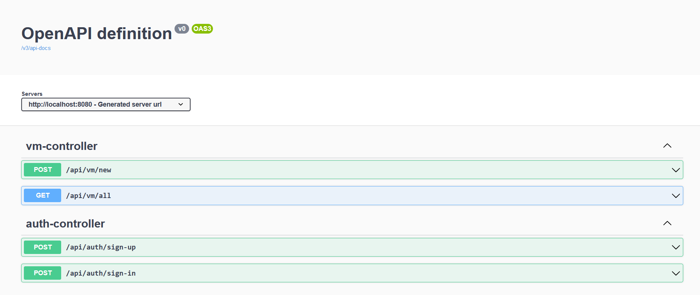

# Virtual Machine Provision API 

## API that would allow you to create virtual machines based on your need 

Technology Used
 - Spring Boot
 - Postgres
 - Open API for Swagger

## How to Run?

Install Docker 

- [Windows Install](https://docs.docker.com/desktop/windows/install/)
- [Ubuntu Install](https://www.digitalocean.com/community/tutorials/how-to-install-and-use-docker-on-ubuntu-18-04)

Install Postgres 
```
docker pull postgres
docker run -e POSTGRES_PASSWORD=admin -e POSTGRES_USER=postgres postgres

-- Sometimes there could be issue with connection from api to postgres
Just update hba.conf file to accept host.
```

Run API 
``` sh / cmd
cd vm-provision-api
docker build -t vm-provision-api .
docker run -itd -p 8080:8080 vm-provision-api
```

## Swagger API



- [auth-controller](http://localhost:8080/swagger-ui/index.html?configUrl=/v3/api-docs/swagger-config#/auth-controller/registerUser)
  - Register New User
  - Login to APP to fetch / create new Virtual Machines.
- [vm-controller](http://localhost:8080/swagger-ui/index.html?configUrl=/v3/api-docs/swagger-config#/vm-controller/createVirtualMachine)
  - VM Controller contains two API, new virtual machine creation 
  - Get all the virtual machines that are created.

## Further Improvements:
- Paginatin for Get all VM is not implemented.
- Unit Tests are written only for few units, it can be further improved to have more than 80 - 90% Coverage on an average
- We can have our identity verification can be done using AD / IDP using cloud.
- All configurations can be moved to external config ( like helm for kube).
- instead of Dockerfile we can use gib to have cleaner and simpler image generation.
- jwt can include further data like user id , expiry date which then we can intern have refresh token call when it expires.
- Integration tests can be written in order to have integration between systems be tested.
- Currently, using simple  JPA Repo , based on complexity of data we could have complex model to handle one to many, many to one insert , update and fetch calls.

