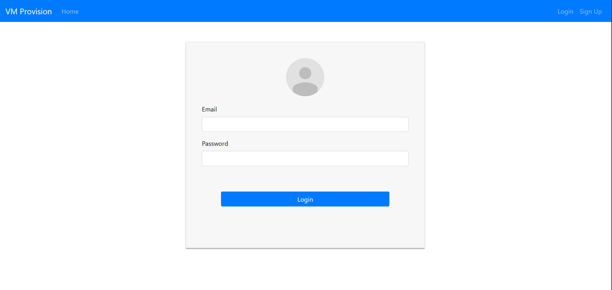
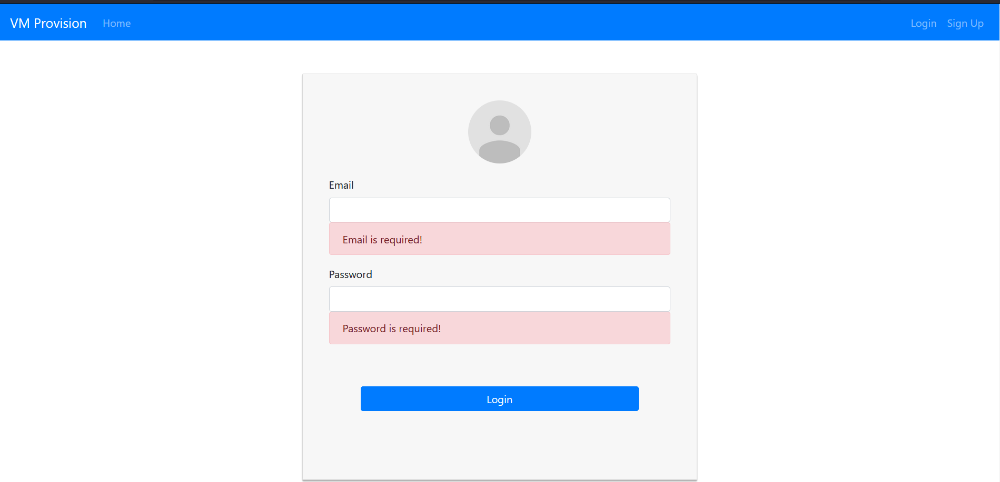
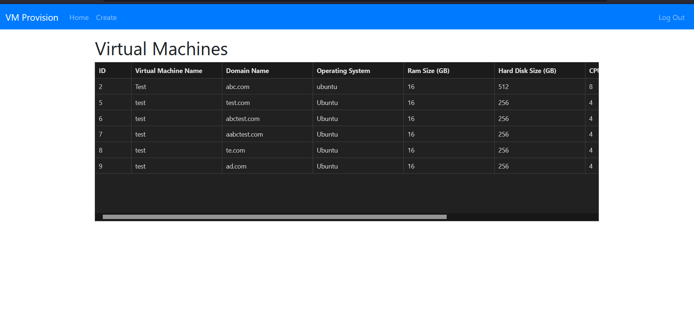
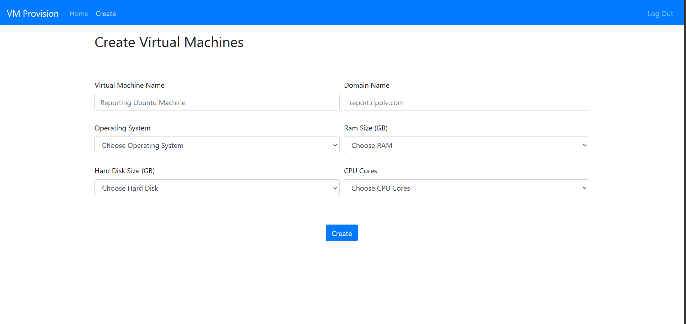

# Virtual Machine Provision UI

## UI that would allow you to create virtual machines based on your need 

Technology Used
 - Reactjs 
 - Typescript
 - Nginx

## How to Run?

Install Docker 

- [Windows Install](https://docs.docker.com/desktop/windows/install/)
- [Ubuntu Install](https://www.digitalocean.com/community/tutorials/how-to-install-and-use-docker-on-ubuntu-18-04)

Run UI 
``` sh / cmd
# .env File has port for the ui. For sake of this assignment API URL is hardcoded into service layer.

cd vm-provision-ui
docker build -t vm-provision-ui .
docker run -itd -p 8081:8081 vm-provision-ui
```
- [UI-URL](http://localhost:8080)


## UI







## Further Improvements:
- Pagination for grid
- Have css improvements to make it look better.
- encode password while on http call
- React hooks can be used to further improve the code quality.
- Unit tests can be written to have consistency.
- All configurations can be moved to external config ( like helm for kube).


